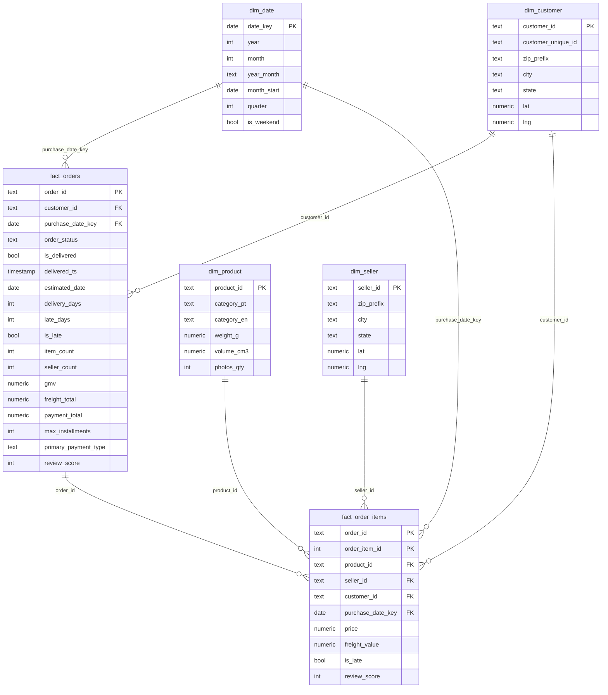

# Entity-relationship diagram

## Mart (star schema)



Grain: `fact_orders` = one order; `fact_order_items` = one item line. `dim_customer` is
keyed on `customer_id` (Olist issues a new id per order); the real person is
`customer_unique_id`, which is what repeat-purchase and cohort queries group by.

## Source tables and how they flow

```mermaid
flowchart LR
    subgraph raw
        R1[orders] & R2[order_items] & R3[order_payments] & R4[order_reviews]
        R5[customers] & R6[sellers] & R7[products] & R8[category_translation] & R9[geolocation]
    end
    subgraph staging
        S1[orders + delivery metrics] & S2[order_items] & S3[order_payments]
        S4[order_reviews dedup 1/order] & S5[customers] & S6[sellers]
        S7[products + category_en] & S9[geolocation 1/zip]
    end
    subgraph mart
        F1[fact_orders] & F2[fact_order_items]
        D1[dim_customer] & D2[dim_seller] & D3[dim_product] & D4[dim_date]
    end
    R1-->S1 R2-->S2 R3-->S3 R4-->S4 R5-->S5 R6-->S6 R7-->S7 R8-->S7 R9-->S9
    S1-->F1 S2-->F1 S3-->F1 S4-->F1
    S1-->F2 S2-->F2 S4-->F2
    S5-->D1 S9-->D1 S6-->D2 S9-->D2 S7-->D3
```
